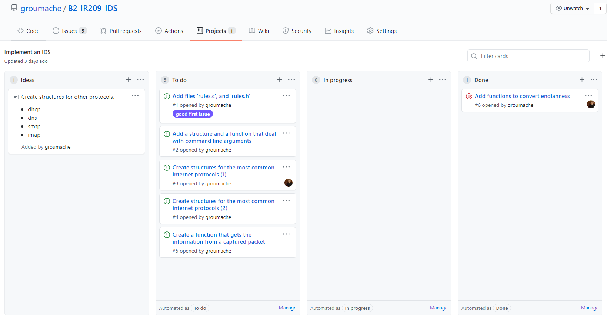
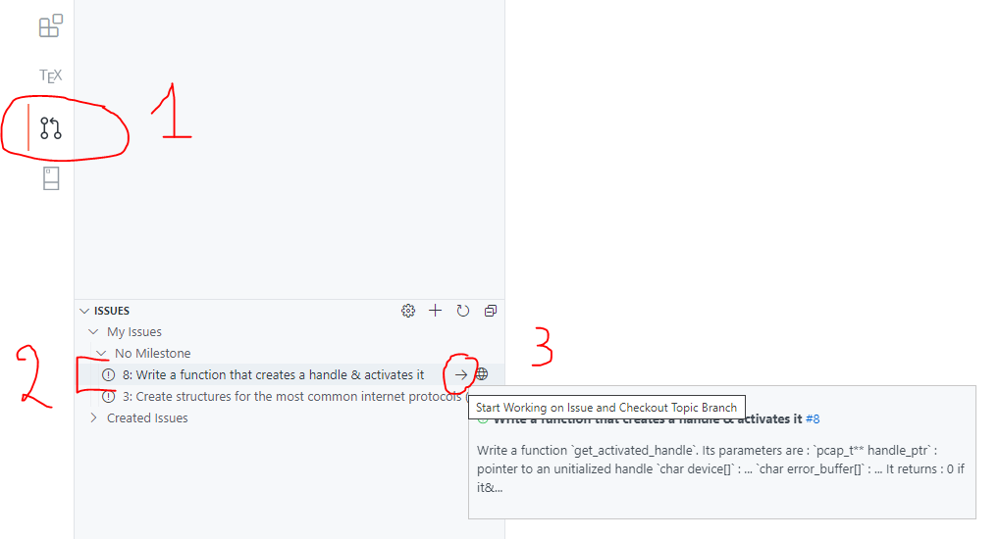
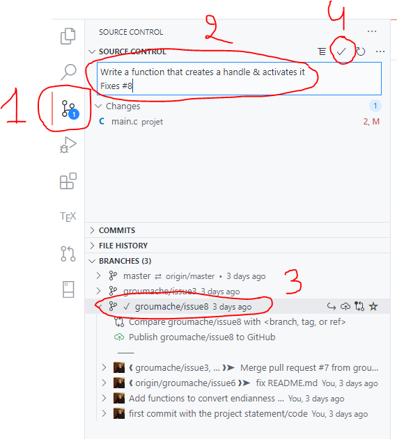

# Project Management Process

- [Project Management Process](#project-management-process)
  - [1. Project's organization](#1-projects-organization)
  - [2. How to contribute to the project](#2-how-to-contribute-to-the-project)
    - [Prepare your computer coding setup](#prepare-your-computer-coding-setup)
    - [Write code to solve the issue](#write-code-to-solve-the-issue)
  - [3. Example (1) : add an issue](#3-example-1--add-an-issue)
  - [4. Example (2) : contribute to the project](#4-example-2--contribute-to-the-project)
    - [**1. Create a branch**](#1-create-a-branch)
    - [**2. Code**](#2-code)
    - [**3. Commit**](#3-commit)
    - [**4. Pull request**](#4-pull-request)
    - [**5. Review & Merge**](#5-review--merge)
    - [**6. Close & Pull**](#6-close--pull)
  - [4. Example (3) : update a fork](#4-example-3--update-a-fork)

## 1. Project's organization

The project is divided in four parts:

1. **Ideas**: a place to add notes that exceed the project requirements
2. **To do**: the place where issues go when they are created (corresponds to the project requirements)
3. **In progress**: when the pull request has been submitted
4. **Done**: when the issue is closed or the pull request has been merged

On the *network graph* below, you can see that every branch opened to solve an issue ultimately comes back to the main branch in order to improve it.

## 2. How to contribute to the project

### Prepare your computer coding setup

1. **Install**: install git, vscode and install the extensions *gitlens* and *github pull requests and issues* to vscode
2. **Initialize**: clone the project locally :
    - `mkdir project`
    - `git clone https://github.com/groumache/B2-IR209-IDS.git project`
    - `git config --global user.name "<first_name> <last_name>"`
    - `git config --global user.email "<email>"`

### Write code to solve the issue

1. **Create a branch** open the *github* extension, select an issue and click on *start working on issue and checkout topic branch*
2. **Code**: make modifications to the code
3. **Commit**: commit every time you add or modify a feature **and** the code still compiles and works
4. **Pull request**: once you have made enough modification that the issue can be closed, create a pull request
5. **Review & Merge**: review the code, make modifications, and merge the pull request
6. **Close & Pull**: close the branch that was opened to deal with the issue, and pull on your local master branch

## 3. Example (1) : add an issue

Explanation:

1. Title of the issue
2. Explanation of the issue
3. You can assign people to an issue, they are responsible for solving the issue
4. The project in which the issue will appear

## 4. Example (2) : contribute to the project

### **1. Create a branch**

    1. This is the github extension
    2. This is the issue we have just been assigned
    3. Click on the arrow to start working on the issue

### **2. Code**

### **3. Commit**

    1. The source control extension
    2. The commit message, it should explain the changes you made
    3. The branch you are commiting to, be sure to commit to the right one !
    4. The commit button

### **4. Pull request**

    1. This is the github extension
    2. Select the branch you've been working on
    3. Make a right click on the branch, then click on *create pull request*

### **5. Review & Merge**

### **6. Close & Pull**

Close the branch (It should only be done when the pull request is merged !):

    1. This is the source control extension
    2. Check to you have switched to another branch
    3. Right click on the branch you want to delete
    4. Click on *delete branch*

Update you local master branch:

    1. This is the source control extension
    2. Check to you have switched to your local master branch
    3. Click on *pull*

Change your local code base:

    1. This is the source control extension
    2. Click on *discard all changes*

## 4. Example (3) : update a fork

Update your github branch (note: this branch is not from our project):

Update your local branch:

