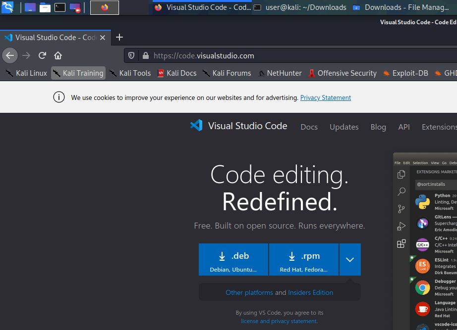
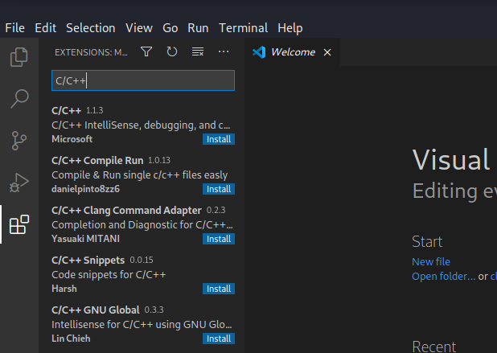
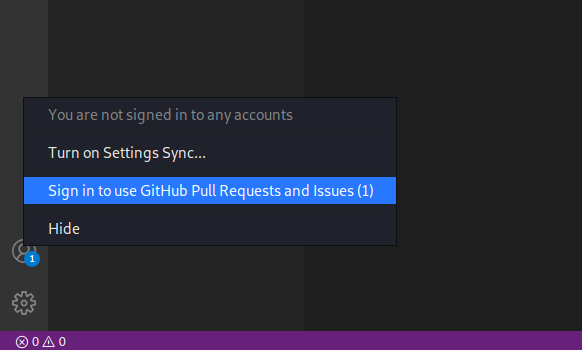
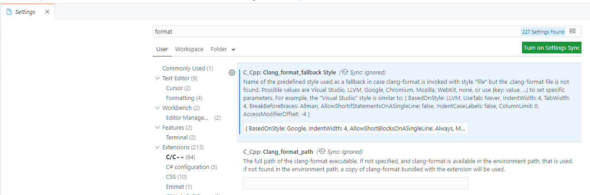
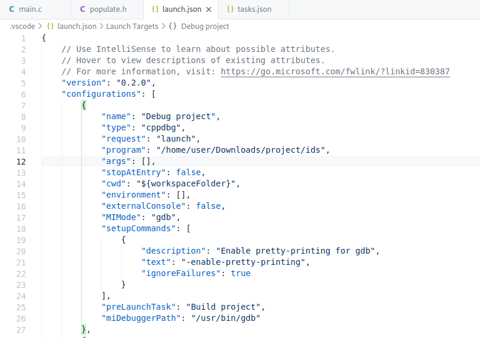
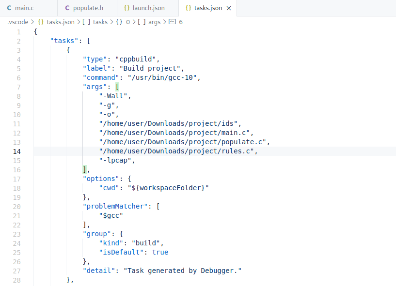
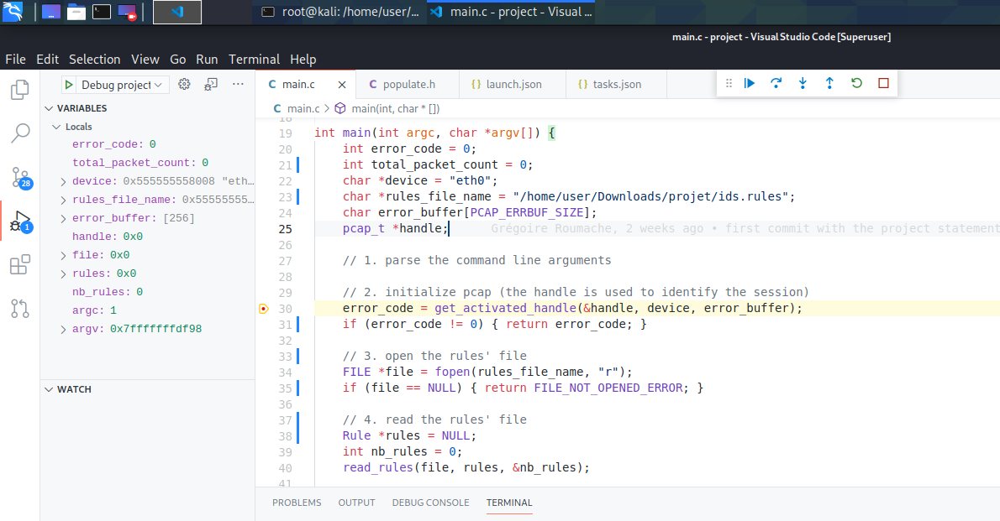

# Project Setup

## Install `libpcap-dev`, `gcc`, `git`, and `valgrind`

    1. `sudo apt install libpcap-dev gcc git valgrind`

## Install visual studio code

    1. Go to the download page of visual studio code and download the .deb version
    2. Open the terminal in the download folder (/home/user/Downloads), and type the command: `dpkg -i <file.deb>`

## In visual studio code, install the extensions `gitlens`, `github pull requests and issues`, and `C/C++`

## Setup automatic formatting in vscode

Content of the setting:

    {
        BasedOnStyle: Google,
        IndentWidth: 4,
        AllowShortBlocksOnASingleLine: Always,
        MaxEmptyLinesToKeep: 2,
        IndentPPDirectives: BeforeHash
    }

## Setup the tasks for building and debugging the project

How to build and debug the project:

Note: to check for memory leaks, it is very useful to run the program using valgrind:

    valgrind --leak-check=full \
         --show-leak-kinds=all \
         --track-origins=yes \
         --verbose \
         ./ids

If the program has been compiled with a debug flag, it should even give the line where the memory was allocated.
